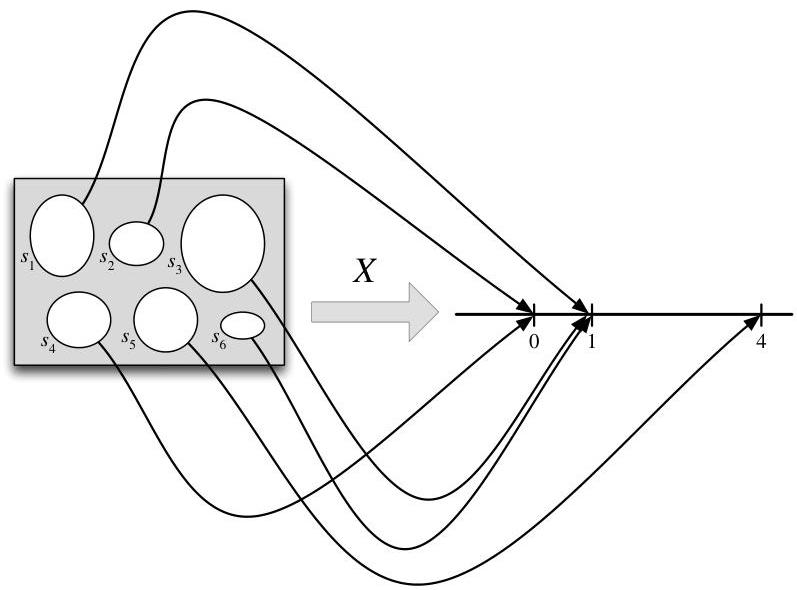

Introduction to Probability

version of "a random variable is a variable that takes on random values", but such a feeble attempt at a definition fails to say where the randomness come from. Nor does it help us to derive properties of random variables: we're familiar with working with algebraic equations like  $x^{2} + y^{2} = 1$ , but what are the valid mathematical operations if  $x$  and  $y$  are random variables? To make the notion of random variable precise, we define it as a function mapping the sample space to the real line. (See the math appendix for review of some concepts about functions.)

# FIGURE 3.1

A random variable maps the sample space into the real line. The r.v.  $X$  depicted here is defined on a sample space with 6 elements, and has possible values 0, 1, and 4. The randomness comes from choosing a random pebble according to the probability function  $P$  for the sample space.

Definition 3.1.1 (Random variable). Given an experiment with sample space  $S$ , a random variable (r.v.) is a function from the sample space  $S$  to the real numbers  $\mathbb{R}$ . It is common, but not required, to denote random variables by capital letters.

Thus, a random variable  $X$  assigns a numerical value  $X(s)$  to each possible outcome  $s$  of the experiment. The randomness comes from the fact that we have a random experiment (with probabilities described by the probability function  $P$ ); the mapping itself is deterministic, as illustrated in Figure 3.1. The same r.v. is shown in a simpler way in the left panel of Figure 3.2, in which we inscribe the values inside the pebbles.

This definition is abstract but fundamental; one of the most important skills to develop when studying probability and statistics is the ability to go back and forth between abstract ideas and concrete examples. Relatedly, it is important to work on recognizing the essential pattern or structure of a problem and how it connects