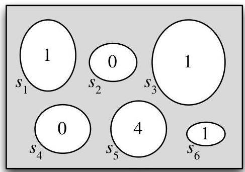
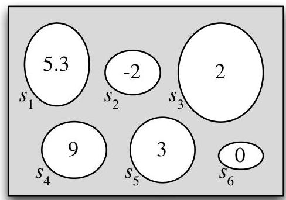

Introduction to Probability

defined on the same sample space: the pebbles or outcomes are the same, but the real numbers assigned to the outcomes are different.

FIGURE 3.2

Two random variables defined on the same sample space.

As we've mentioned earlier, the source of the randomness in a random variable is the experiment itself, in which a sample outcome  $s \in S$  is chosen according to a probability function  $P$ . Before we perform the experiment, the outcome  $s$  has not yet been realized, so we don't know the value of  $X$ , though we could calculate the probability that  $X$  will take on a given value or range of values. After we perform the experiment and the outcome  $s$  has been realized, the random variable crystallizes into the numerical value  $X(s)$ .

Random variables provide numerical summaries of the experiment in question. This is very handy because the sample space of an experiment is often incredibly complicated or high-dimensional, and the outcomes  $s \in S$  may be non-numeric. For example, the experiment may be to collect a random sample of people in a certain city and ask them various questions, which may have numeric (e.g., age or height) or non-numeric (e.g., political party or favorite movie) answers. The fact that r.v.s take on numerical values is a very convenient simplification compared to having to work with the full complexity of  $S$  at all times.

# 3.2 Distributions and probability mass functions

There are two main types of random variables used in practice: discrete r.v.s and continuous r.v.s. In this chapter and the next, our focus is on discrete r.v.s. Continuous r.v.s are introduced in Chapter 5.

Definition 3.2.1 (Discrete random variable). A random variable  $X$  is said to be discrete if there is a finite list of values  $a_1, a_2, \ldots, a_n$  or an infinite list of values  $a_1, a_2, \ldots$  such that  $P(X = a_j \text{ for some } j) = 1$ . If  $X$  is a discrete r.v., then the