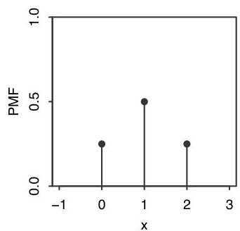
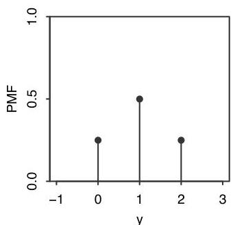
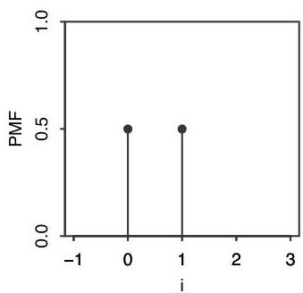

Introduction to Probability

and 2 if  $HH$  occurs, the PMF of  $X$  is the function  $p_X$  given by

$$
p _ {X} (0) = P (X = 0) = 1 / 4,
$$

$$
p _ {X} (1) = P (X = 1) = 1 / 2,
$$

$$
p _ {X} (2) = P (X = 2) = 1 / 4,
$$

and  $p_X(x) = 0$  for all other values of  $x$ .

-  $Y = 2 - X$ , the number of Tails. Reasoning as above or using the fact that

$$
P (Y = y) = P (2 - X = y) = P (X = 2 - y) = p _ {X} (2 - y),
$$

the PMF of  $Y$  is

$$
p _ {Y} (0) = P (Y = 0) = 1 / 4,
$$

$$
p _ {Y} (1) = P (Y = 1) = 1 / 2,
$$

$$
p _ {Y} (2) = P (Y = 2) = 1 / 4,
$$

and  $p_{Y}(y) = 0$  for all other values of  $y$ .

Note that  $X$  and  $Y$  have the same PMF (that is,  $p_X$  and  $p_Y$  are the same function) even though  $X$  and  $Y$  are not the same r.v. (that is,  $X$  and  $Y$  are two different functions from  $\{HH, HT, TH, TT\}$  to the real line).

-  $I$ , the indicator of the first toss landing Heads. Since  $I$  equals 0 if  $TH$  or  $TT$  occurs and 1 if  $HH$  or  $HT$  occurs, the PMF of  $I$  is

$$
p _ {I} (0) = P (I = 0) = 1 / 2,
$$

$$
p _ {I} (1) = P (I = 1) = 1 / 2,
$$

and  $p_I(i) = 0$  for all other values of  $i$ .

# FIGURE 3.3

Left to right: PMFs of  $X$ ,  $Y$ , and  $I$ , with  $X$  the number of Heads in two fair coin tosses,  $Y$  the number of Tails, and  $I$  the indicator of Heads on the first toss.

The PMFs of  $X$ ,  $Y$ , and  $I$  are plotted in Figure 3.3. Vertical bars are drawn to make it easier to compare the heights of different points.