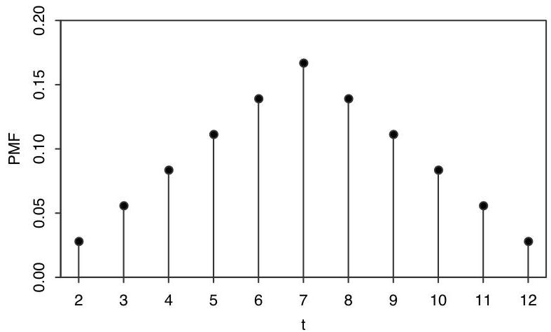

Introduction to Probability

is  $\{2,3,\ldots ,12\}$  just by looking at the possible totals for two dice, but as a check, note that

$$
P (T = 2) + P (T = 3) + \dots + P (T = 1 2) = 1,
$$

which shows that all possibilities have been accounted for. The symmetry property of  $T$  that appears above,  $P(T = t) = P(T = 14 - t)$ , makes sense since each outcome  $\{X = x, Y = y\}$  which makes  $T = t$  has a corresponding outcome  $\{X = 7 - x, Y = 7 - y\}$  of the same probability which makes  $T = 14 - t$ .

FIGURE 3.4 PMF of the sum of two die rolls.

The PMF of  $T$  is plotted in Figure 3.4; it has a triangular shape, and the symmetry noted above is very visible.

Example 3.2.6 (Children in a U.S. household). Suppose we choose a household in the United States at random. Let  $X$  be the number of children in the chosen household. Since  $X$  can only take on integer values, it is a discrete r.v. The probability that  $X$  takes on the value  $x$  is proportional to the number of households in the United States with  $x$  children.

Using data from the 2010 General Social Survey [23], we can approximate the proportion of households with 0 children, 1 child, 2 children, etc., and hence approximate the PMF of  $X$ , which is plotted in Figure 3.5.

We will now state the properties of a valid PMF.

Theorem 3.2.7 (Valid PMFs). Let  $X$  be a discrete r.v. with support  $x_{1}, x_{2}, \ldots$  (assume these values are distinct and, for notational simplicity, that the support is countably infinite; the analogous results hold if the support is finite). The PMF  $p_{X}$  of  $X$  must satisfy the following two criteria:

- Nonnegative:  $p_X(x) &gt; 0$  if  $x = x_j$  for some  $j$ , and  $p_X(x) = 0$  otherwise;
- Sums to 1:  $\sum_{j=1}^{\infty} p_X(x_j) = 1$ .