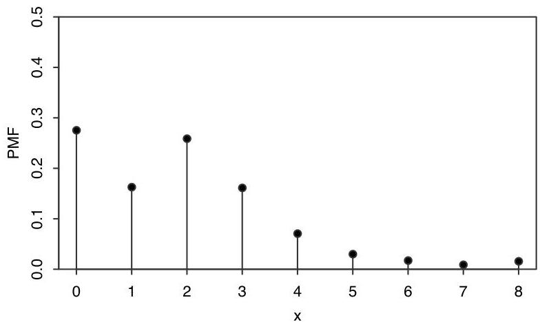

Random variables and their distributions

FIGURE 3.5 PMF of the number of children in a randomly selected U.S. household.

Proof. The first criterion is true since probability is nonnegative. The second is true since  $X$  must take on some value, and the events  $\{X = x_{j}\}$  are disjoint, so

$$
\sum_ {j = 1} ^ {\infty} P (X = x _ {j}) = P \left(\bigcup_ {j = 1} ^ {\infty} \{X = x _ {j} \}\right) = P (X = x _ {1} \text {o r} X = x _ {2} \text {o r} \dots) = 1.
$$

Conversely, if distinct values  $x_{1}, x_{2}, \ldots$  are specified and we have a function satisfying the two criteria above, then this function is the PMF of some r.v.; we will show how to construct such an r.v. in Chapter 5.

We claimed earlier that the PMF is one way of expressing the distribution of a discrete r.v. This is because once we know the PMF of  $X$ , we can calculate the probability that  $X$  will fall into a given subset of the real numbers by summing over the appropriate values of  $x$ , as the next example shows.

Example 3.2.8. Returning to Example 3.2.5, let  $T$  be the sum of two fair die rolls. We have already calculated the PMF of  $T$ . Now suppose we're interested in the probability that  $T$  is in the interval [1, 4]. There are only three values in the interval [1, 4] that  $T$  can take on, namely, 2, 3, and 4. We know the probability of each of these values from the PMF of  $T$ , so

$$
P (1 \leq T \leq 4) = P (T = 2) + P (T = 3) + P (T = 4) = 6 / 3 6.
$$

In general, given a discrete r.v.  $X$  and a set  $B$  of real numbers, if we know the PMF of  $X$  we can find  $P(X \in B)$ , the probability that  $X$  is in  $B$ , by summing up the heights of the vertical bars at points in  $B$  in the plot of the PMF of  $X$ . Knowing the PMF of a discrete r.v. determines its distribution.