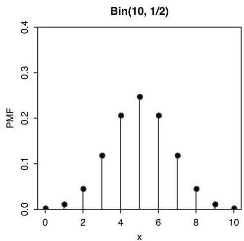
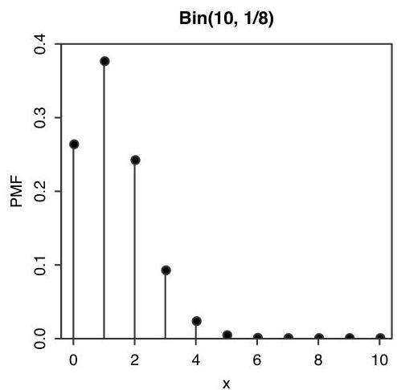
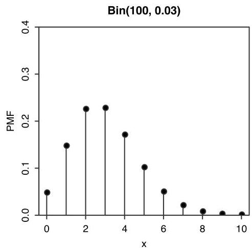
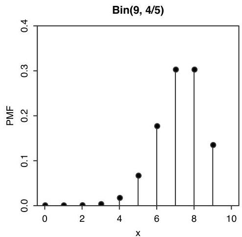

Introduction to Probability

FIGURE 3.6 Some Binomial PMFs. In the lower left, we plot the  $\mathrm{Bin}(100,0.03)$  PMF between 0 and 10 only, as the probability of more than 10 successes is close to 0.

