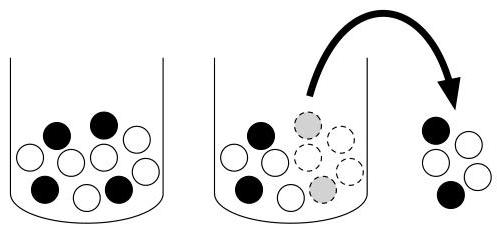

Introduction to Probability

FIGURE 3.7

Hypergeometric story. An urn contains  $w = 6$  white balls and  $b = 4$  black balls. We sample  $n = 5$  without replacement. The number  $X$  of white balls in the sample is Hypergeometric; here we observe  $X = 3$ .

As with the Binomial distribution, we can obtain the PMF of the Hypergeometric distribution from the story.

Theorem 3.4.2 (Hypergeometric PMF). If  $X \sim \mathrm{HGeom}(w, b, n)$ , then the PMF of  $X$  is

$$
P (X = k) = \frac {\binom {w} {k} \binom {b} {n - k}}{\binom {w + b} {n}},
$$

for integers  $k$  satisfying  $0 \leq k \leq w$  and  $0 \leq n - k \leq b$ , and  $P(X = k) = 0$  otherwise.

Proof. To get  $P(X = k)$ , we first count the number of possible ways to draw exactly  $k$  white balls and  $n - k$  black balls from the urn (without distinguishing between different orderings for getting the same set of balls). If  $k &gt; w$  or  $n - k &gt; b$ , then the draw is impossible. Otherwise, there are  $\binom{w}{k} \binom{b}{n-k}$  ways to draw  $k$  white and  $n - k$  black balls by the multiplication rule, and there are  $\binom{w+b}{n}$  total ways to draw  $n$  balls. Since all samples are equally likely, the naive definition of probability gives

$$
P (X = k) = \frac {\binom {w} {k} \binom {b} {n - k}}{\binom {w + b} {n}}
$$

for integers  $k$  satisfying  $0 \leq k \leq w$  and  $0 \leq n - k \leq b$ . This PMF is valid because the numerator, summed over all  $k$ , equals  $\binom{w + b}{n}$  by Vandermonde's identity (Example 1.5.3), so the PMF sums to 1.

The Hypergeometric distribution comes up in many scenarios which, on the surface, have little in common with white and black balls in an urn. The essential structure of the Hypergeometric story is that items in a population are classified using two sets of tags: in the urn story, each ball is either white or black (this is the first set of tags), and each ball is either sampled or not sampled (this is the second set of tags). Furthermore, at least one of these sets of tags is assigned completely at random (in the urn story, the balls are sampled randomly, with all sets of the correct size equally likely). Then  $X \sim \mathrm{HGeom}(w, b, n)$  represents the number of twice-tagged items: in the urn story, balls that are both white and sampled.