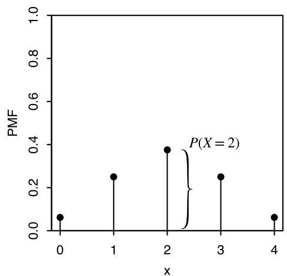
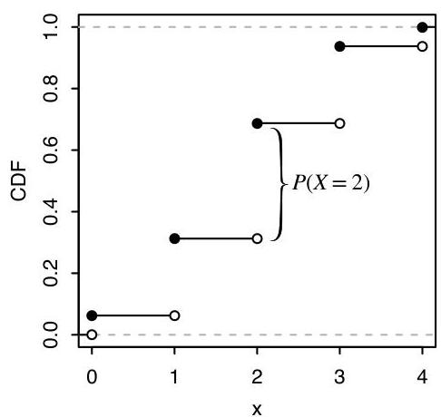

Random variables and their distributions

Definition 3.6.1. The cumulative distribution function (CDF) of an r.v.  $X$  is the function  $F_{X}$  given by  $F_{X}(x) = P(X \leq x)$ . When there is no risk of ambiguity, we sometimes drop the subscript and just write  $F$  (or some other letter) for a CDF.

The next example demonstrates that for discrete r.v.s, we can freely convert between CDF and PMF.

Example 3.6.2. Let  $X \sim \operatorname{Bin}(4,1/2)$ . Figure 3.8 shows the PMF and CDF of  $X$ .

FIGURE 3.8

$\operatorname{Bin}(4,1/2)$  PMF and CDF. The height of the vertical bar  $P(X = 2)$  in the PMF is also the height of the jump in the CDF at 2.

- From PMF to CDF: To find  $P(X \leq 1.5)$ , which is the CDF evaluated at 1.5, we sum the PMF over all values of the support that are less than or equal to 1.5:

$$
P (X \leq 1. 5) = P (X = 0) + P (X = 1) = \left(\frac {1}{2}\right) ^ {4} + 4 \left(\frac {1}{2}\right) ^ {4} = \frac {5}{1 6}.
$$

Similarly, the value of the CDF at an arbitrary point  $x$  is the sum of the heights of the vertical bars of the PMF at values less than or equal to  $x$ .

- From CDF to PMF: The CDF of a discrete r.v. consists of jumps and flat regions. The height of a jump in the CDF at  $x$  is equal to the value of the PMF at  $x$ . For example, in Figure 3.8, the height of the jump in the CDF at 2 is the same as the height of the corresponding vertical bar in the PMF; this is indicated in the figure with curly braces. The flat regions of the CDF correspond to values outside the support of  $X$ , so the PMF is equal to 0 in those regions.

Valid CDFs satisfy the following criteria.

Theorem 3.6.3 (Valid CDFs). Any CDF  $F$  has the following properties.

- Increasing: If  $x_{1} \leq x_{2}$ , then  $F(x_{1}) \leq F(x_{2})$ .