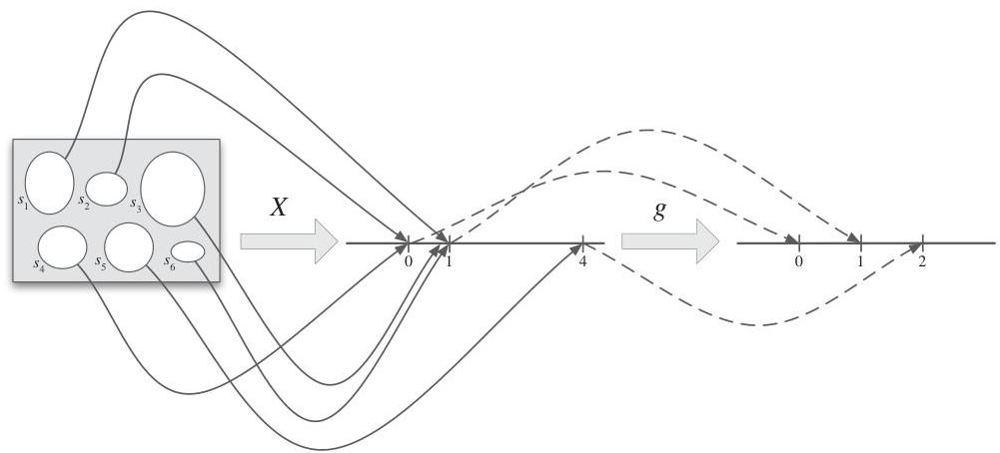
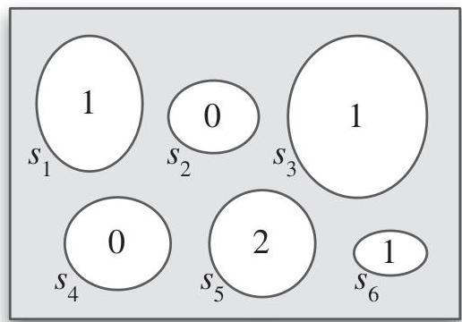

Introduction to Probability

FIGURE 3.9

The r.v.  $X$  is defined on a sample space with 6 elements, and has possible values 0, 1, and 4. The function  $g$  is the square root function. Composing  $X$  and  $g$  gives the random variable  $g(X) = \sqrt{X}$ , which has possible values 0, 1, and 2.

FIGURE 3.10

Since  $g(X) = \sqrt{X}$  labels each pebble with a number, it is an r.v.