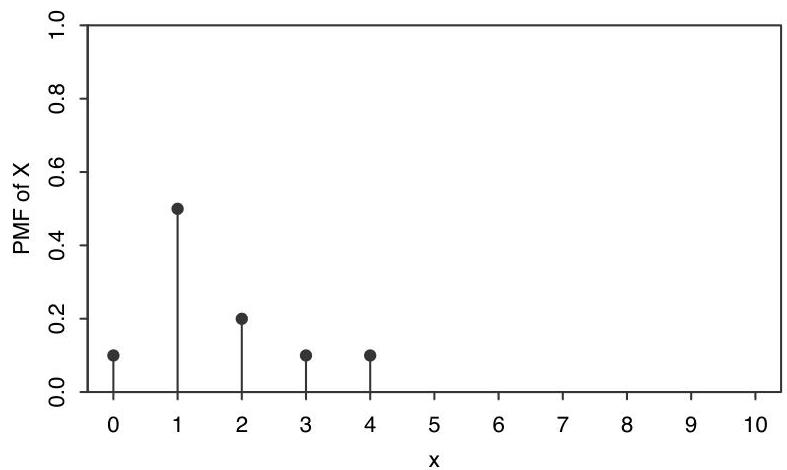
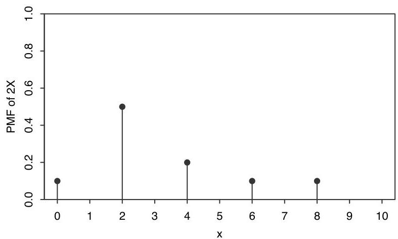

Introduction to Probability

We can think of the distribution of a random variable as a map or blueprint describing the r.v. Just as different houses can share the same blueprint, different r.v.s can have the same distribution, even if the experiments they summarize, and the sample spaces they map from, are not the same.

Here are two examples of sympathetic magic:

- Given an r.v.  $X$ , trying to get the PMF of  $2X$  by multiplying the PMF of  $X$  by 2. It does not make sense to multiply a PMF by 2, since the probabilities would no longer sum to 1. As we saw above, if  $X$  takes on values  $x_{j}$  with probabilities  $p_{j}$ , then  $2X$  takes on values  $2x_{j}$  with probabilities  $p_{j}$ . Therefore the PMF of  $2X$  is a horizontal stretch of the PMF of  $X$ ; it is not a vertical stretch, as would result from multiplying the PMF by 2. Figure 3.11 shows the PMF of a discrete r.v.  $X$  with support  $\{0,1,2,3,4\}$ , along with the PMF of  $2X$ , which has support  $\{0,2,4,6,8\}$ . Note that  $X$  can take on odd values, but  $2X$  is necessarily even.

FIGURE 3.11 PMF of  $X$  (above) and PMF of  $2X$  (below).