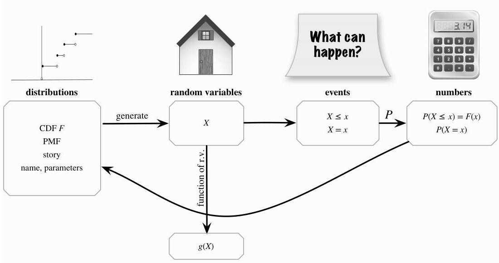

Random variables and their distributions

- A HGeom  $(w, b, n)$  r.v. is the number of white balls obtained in a sample of size  $n$  drawn without replacement from an urn of  $w$  white and  $b$  black balls.
- A DUnif  $(C)$  r.v. is obtained by randomly choosing an element of the finite set  $C$ , with equal probabilities for each element.

A function of a random variable is still a random variable. If we know the PMF of  $X$ , we can find  $P(g(X) = k)$ , the PMF of  $g(X)$ , by translating the event  $\{g(X) = k\}$  into an equivalent event involving  $X$ , then using the PMF of  $X$ .

Two random variables are independent if knowing the value of one r.v. gives no information about the value of the other. This is unrelated to whether the two r.v.s are identically distributed. In Chapter 7, we will learn how to deal with dependent random variables by considering them jointly rather than separately.

We have now seen four fundamental types of objects in probability: distributions, random variables, events, and numbers. Figure 3.12 shows connections between these four fundamental objects. A CDF can be used as a blueprint for generating an r.v., and then there are various events describing the behavior of the r.v., such as the events  $X \leq x$  for all  $x$ . Knowing the probabilities of these events determines the CDF, taking us full circle. For a discrete r.v. we can also use the PMF as a blueprint, and go from distribution to r.v. to events and back again.

# FIGURE 3.12

Four fundamental objects in probability: distributions (blueprints), random variables, events, and numbers. From a CDF  $F$  we can generate an r.v.  $X$ . From  $X$ , we can generate many other r.v.s by taking functions of  $X$ . There are various events describing the behavior of  $X$ . Most notably, for any constant  $x$  the events  $X \leq x$  and  $X = x$  are of interest. Knowing the probabilities of these events for all  $x$  gives us the CDF and (in the discrete case) the PMF, taking us full circle.