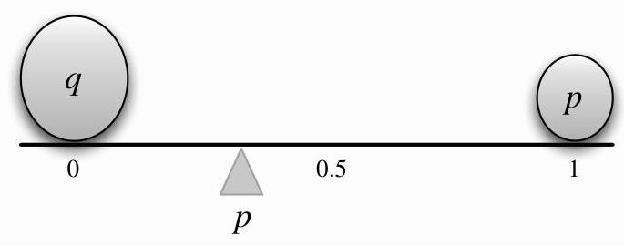

Expectation

# FIGURE 4.1

Center of mass of two pebbles, depicting that  $E(X) = p$  for  $X \sim \operatorname{Bern}(p)$ . Here  $q$  and  $p$  denote the masses of the two pebbles.

from the distribution of  $X$  are generated. For  $n$  large, we would expect to have about  $p_1n a_1$ 's,  $p_2n a_2$ 's, and  $p_3n a_3$ 's. (We will look at a more mathematical version of this example when we study the law of large numbers in Chapter 10.) If the simulation results are close to these expected results, then the arithmetic mean of the simulation results is approximately

$$
\frac {p _ {1} n \cdot a _ {1} + p _ {2} n \cdot a _ {2} + p _ {3} n \cdot a _ {3}}{n} = p _ {1} a _ {1} + p _ {2} a _ {2} + p _ {3} a _ {3} = E (X).
$$

Note that  $E(X)$  depends only on the distribution of  $X$ . This follows directly from the definition, but is worth recording since it is fundamental.

Proposition 4.1.2. If  $X$  and  $Y$  are discrete r.v.s with the same distribution, then  $E(X) = E(Y)$  (if either side exists).

Proof. In the definition of  $E(X)$ , we only need to know the PMF of  $X$ .

The converse of the above proposition is false since the expected value is just a one-number summary, not nearly enough to specify the entire distribution; it's a measure of where the "center" is but does not determine, for example, how spread out the distribution is or how likely the r.v. is to be positive. Figure 4.2 shows an example of two different PMFs with the same expected value (balancing point).

$\star 4.1.3$  (Replacing an r.v. by its expectation). For any discrete r.v.  $X$ , the expected value  $E(X)$  is a number (if it exists). A common mistake is to replace an r.v. by its expectation without justification, which is wrong both mathematically ( $X$  is a function,  $E(X)$  is a constant) and statistically (it ignores the variability of  $X$ ), except in the degenerate case where  $X$  is a constant.

Notation 4.1.4. We often abbreviate  $E(X)$  to  $EX$ . Similarly, we often abbreviate  $E(X^2)$  to  $EX^2$ , and  $E(X^n)$  to  $EX^n$ .

$\star 4.1.5$ . Paying attention to the order of operations is crucial when working with expectation. As stated above,  $EX^2$  is the expectation of the random variable  $X^2$ , not the square of the number  $EX$ . Unless the parentheses explicitly indicate otherwise,