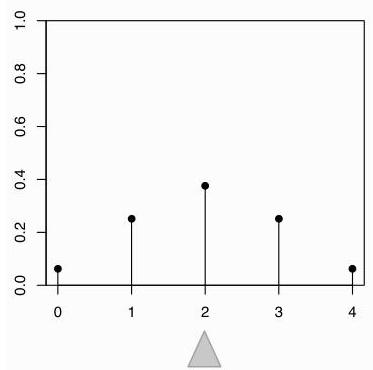
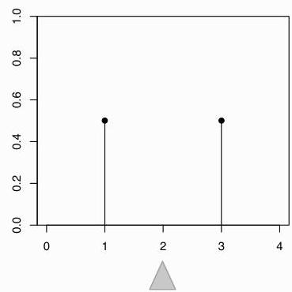

Introduction to Probability

FIGURE 4.2

The expected value does not determine the distribution: different PMFs can have the same balancing point.

for the expectation of an r.v. raised to a power, first we take the power and then we take the expectation. For example,  $E(X - 1)^4$  is  $E\left((X - 1)^4\right)$ , not  $(E(X - 1))^4$ .

# 4.2 Linearity of expectation

The most important property of expectation is linearity: the expected value of a sum of r.v.s is the sum of the individual expected values.

Theorem 4.2.1 (Linearity of expectation). For any r.v.s  $X, Y$  and any constant  $c$ ,

$$
E (X + Y) = E (X) + E (Y),
$$

$$
E (c X) = c E (X).
$$

The second equation says that we can take out constant factors from an expectation; this is both intuitively reasonable and easily verified from the definition. The first equation,  $E(X + Y) = E(X) + E(Y)$ , also seems reasonable when  $X$  and  $Y$  are independent. What may be surprising is that it holds even if  $X$  and  $Y$  are dependent! To build intuition for this, consider the extreme case where  $X$  always equals  $Y$ . Then  $X + Y = 2X$ , and both sides of  $E(X + Y) = E(X) + E(Y)$  are equal to  $2E(X)$ , so linearity still holds even in the most extreme case of dependence.

Linearity is true for all r.v.s, not just discrete r.v.s, but in this chapter we will prove it only for discrete r.v.s. Before proving linearity, it is worthwhile to recall some basic facts about averages. If we have a list of numbers, say  $(1,1,1,1,1,3,3,5)$ , we can calculate their mean by adding all the values and dividing by the length of the list, so that each element of the list gets a weight of  $\frac{1}{8}$ :

$$
\frac {1}{8} (1 + 1 + 1 + 1 + 1 + 3 + 3 + 5) = 2.
$$