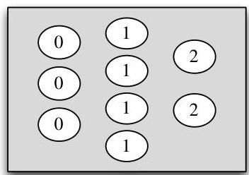
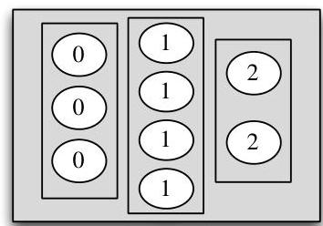

Expectation

But another way to calculate the mean is to group together all the 1's, all the 3's, and all the 5's, and then take a weighted average, giving appropriate weights to 1's, 3's, and 5's:

$$
\frac {5}{8} \cdot 1 + \frac {2}{8} \cdot 3 + \frac {1}{8} \cdot 5 = 2.
$$

This insight—that averages can be calculated in two ways, ungrouped or grouped—is all that is needed to prove linearity! Recall that  $X$  is a function which assigns a real number to every outcome  $s$  in the sample space. The r.v.  $X$  may assign the same value to multiple sample outcomes. When this happens, our definition of expectation groups all these outcomes together into a super-pebble whose weight,  $P(X = x)$ , is the total weight of the constituent pebbles. This grouping process is illustrated in Figure 4.3 for a hypothetical r.v. taking values in  $\{0,1,2\}$ . So our definition of expectation corresponds to the grouped way of taking averages.

# FIGURE 4.3

Left:  $X$  assigns a number to each pebble in the sample space. Right: Grouping the pebbles by the value that  $X$  assigns to them, the 9 pebbles become 3 super-pebbles. The weight of a super-pebble is the sum of the weights of the constituent pebbles.

The advantage of this definition is that it allows us to work with the distribution of  $X$  directly, without returning to the sample space. The disadvantage comes when we have to prove theorems like this one, for if we have another r.v.  $Y$  on the same sample space, the super-pebbles created by  $Y$  are different from those created from  $X$ , with different weights  $P(Y = y)$ ; this makes it difficult to combine  $\sum_{x} xP(X = x)$  and  $\sum_{y} yP(Y = y)$ .

Fortunately, we know there's another equally valid way to calculate an average: we can take a weighted average of the values of individual pebbles. In other words, if  $X(s)$  is the value that  $X$  assigns to pebble  $s$ , we can take the weighted average

$$
E (X) = \sum_ {s} X (s) P (\{s \}),
$$

where  $P(\{s\})$  is the weight of pebble  $s$ . This corresponds to the ungrouped way of taking averages. The advantage of this definition is that it breaks down the sample space into the smallest possible units, so we are now using the same weights  $P(\{s\})$  for every random variable defined on this sample space. If  $Y$  is another random