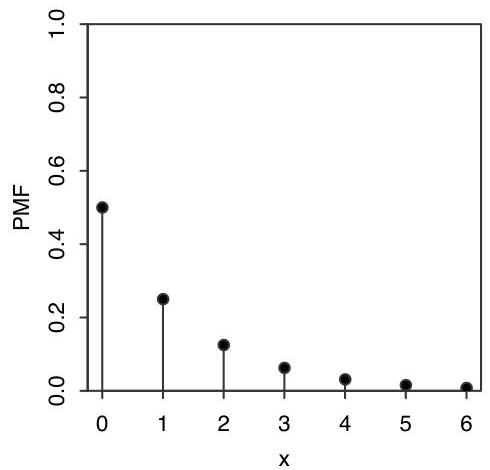
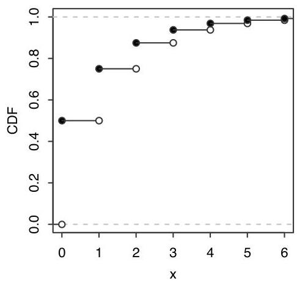

Expectation

FIGURE 4.5

Geom(0.5) PMF and CDF.

Definition 4.3.5 (First Success distribution). In a sequence of independent Bernoulli trials with success probability  $p$ , let  $Y$  be the number of trials until the first successful trial, including the success. Then  $Y$  has the First Success distribution with parameter  $p$ ; we denote this by  $Y \sim \mathrm{FS}(p)$ .

It is easy to convert back and forth between the two but important to be careful about which convention is being used. If  $Y \sim \mathrm{FS}(p)$  then  $Y - 1 \sim \mathrm{Geom}(p)$ , and we can convert between the PMFs of  $Y$  and  $Y - 1$  by writing

$$
P (Y = k) = P (Y - 1 = k - 1).
$$

Conversely, if  $X \sim \operatorname{Geom}(p)$ , then  $X + 1 \sim \operatorname{FS}(p)$ .

Example 4.3.6 (Geometric expectation). Let  $X \sim \operatorname{Geom}(p)$ . By definition,

$$
E (X) = \sum_ {k = 0} ^ {\infty} k q ^ {k} p,
$$

where  $q = 1 - p$ . This sum looks unpleasant; it's not a geometric series because of the extra  $k$  multiplying each term. But we notice that each term looks similar to  $kq^{k-1}$ , the derivative of  $q^k$  (with respect to  $q$ ), so let's start there:

$$
\sum_ {k = 0} ^ {\infty} q ^ {k} = \frac {1}{1 - q}.
$$

This geometric series converges since  $0 &lt; q &lt; 1$ . Differentiating both sides with respect to  $q$ , we get

$$
\sum_ {k = 0} ^ {\infty} k q ^ {k - 1} = \frac {1}{(1 - q) ^ {2}}.
$$