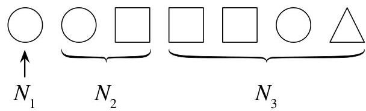

Introduction to Probability

# FIGURE 4.6

Coupon collector,  $n = 3$ . Here  $N_{1}$  is the time (number of toys collected) until the first new toy type,  $N_{2}$  is the additional time until the second new type, and  $N_{3}$  is the additional time until the third new type. The total number of toys for a complete set is  $N_{1} + N_{2} + N_{3}$ .

By the story of the FS distribution,  $N_{2} \sim \mathrm{FS}((n - 1) / n)$ : after collecting the first toy type, there's a  $1 / n$  chance of getting the same toy you already had (failure) and an  $(n - 1) / n$  chance you'll get something new (success). Similarly,  $N_{3}$ , the additional number of toys until the third new toy type, is distributed  $\mathrm{FS}((n - 2) / n)$ . In general,

$$
N _ {j} \sim \mathrm {F S} ((n - j + 1) / n).
$$

By linearity,

$$
\begin{array}{l} E (N) = E \left(N _ {1}\right) + E \left(N _ {2}\right) + E \left(N _ {3}\right) + \dots + E \left(N _ {n}\right) \\ = 1 + \frac {n}{n - 1} + \frac {n}{n - 2} + \dots + n \\ = n \sum_ {j = 1} ^ {n} \frac {1}{j}. \\ \end{array}
$$

For large  $n$ , this is very close to  $n(\log n + 0.577)$ .

Before we leave this example, let's take a moment to connect it to our proof of Theorem 4.3.10, the representation of the Negative Binomial as a sum of i.i.d. Geometrics. In both problems, we are waiting for a specified number of successes, and we approach the problem by considering the intervals between successes. There are two major differences:

- In Theorem 4.3.10, we exclude the successes themselves, so the number of failures between two successes is Geometric. In the coupon collector problem, we include the successes because we want to count the total number of toys, so we have First Success r.v.s instead.
- In Theorem 4.3.10, the probability of success in each trial never changes, so the total number of failures is a sum of i.i.d. Geometrics. In the coupon collector problem, the probability of success decreases after each success, since it becomes harder and harder to find a new toy type you haven't seen before; so the  $N_{j}$  are not identically distributed, though they are independent.

4.3.13 (Expectation of a nonlinear function of an r.v.). Expectation is linear,