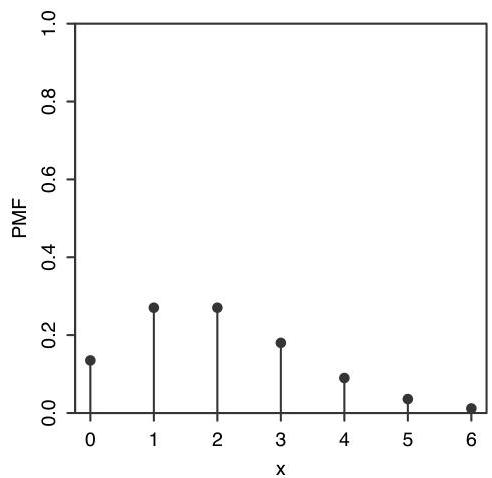
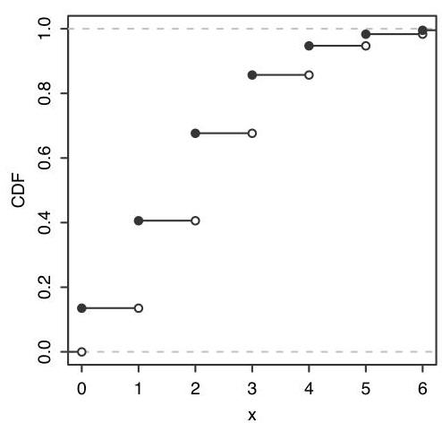
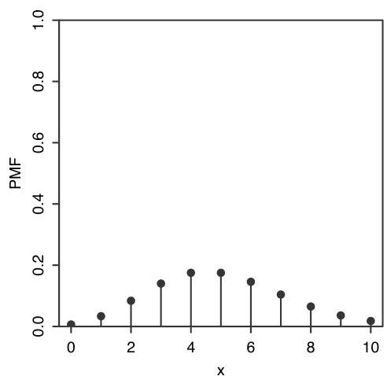
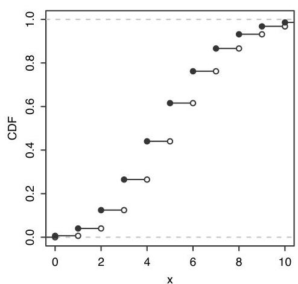

Introduction to Probability

Finally,

$$
E (X ^ {2}) = e ^ {- \lambda} \sum_ {k = 0} ^ {\infty} k ^ {2} \frac {\lambda^ {k}}{k !} = e ^ {- \lambda} e ^ {\lambda} \lambda (1 + \lambda) = \lambda (1 + \lambda),
$$

so

$$
\operatorname {V a r} (X) = E \left(X ^ {2}\right) - (E X) ^ {2} = \lambda (1 + \lambda) - \lambda^ {2} = \lambda .
$$

Thus, the mean and variance of a  $\mathrm{Pois}(\lambda)$  r.v. are both equal to  $\lambda$ .

Figure 4.7 shows the PMF and CDF of the Pois(2) and Pois(5) distributions from  $k = 0$  to  $k = 10$ . It appears that the mean of the Pois(2) is around 2 and the mean of the Pois(5) is around 5, consistent with our findings above. The PMF of the Pois(2) is highly skewed, but as  $\lambda$  grows larger, the skewness is reduced and the PMF becomes more bell-shaped.

FIGURE 4.7 Top: Pois(2) PMF and CDF. Bottom: Pois(5) PMF and CDF.

The Poisson distribution is often used in situations where we are counting the