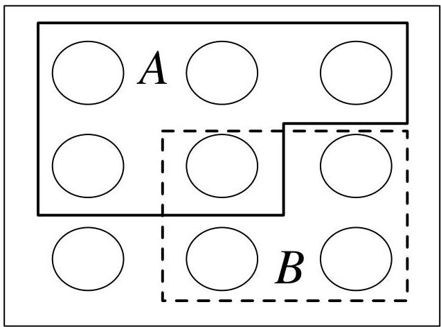

Probability and counting

3. Sanity checks: After solving a problem one way, we will often try to solve the same problem in a different way or to examine whether our answer makes sense in simple and extreme cases.

# 1.2 Sample spaces and Pebble World

The mathematical framework for probability is built around sets. Imagine that an experiment is performed, resulting in one out of a set of possible outcomes. Before the experiment is performed, it is unknown which outcome will be the result; after, the result "crystallizes" into the actual outcome.

Definition 1.2.1 (Sample space and event). The sample space  $S$  of an experiment is the set of all possible outcomes of the experiment. An event  $A$  is a subset of the sample space  $S$ , and we say that  $A$  occurred if the actual outcome is in  $A$ .

FIGURE 1.1 A sample space as Pebble World, with two events  $A$  and  $B$  spotlighted.

The sample space of an experiment can be finite, countably infinite, or uncountably infinite (see Section A.1.5 of the math appendix for an explanation of countable and uncountable sets). When the sample space is finite, we can visualize it as Pebble World, as shown in Figure 1.1. Each pebble represents an outcome, and an event is a set of pebbles.

Performing the experiment amounts to randomly selecting one pebble. If all the pebbles are of the same mass, all the pebbles are equally likely to be chosen. This special case is the topic of the next two sections. In Section 1.6, we give a general definition of probability that allows the pebbles to differ in mass.

Set theory is very useful in probability, since it provides a rich language for express-