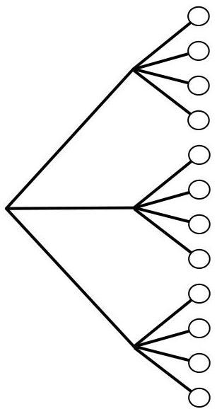

Probability and counting

FIGURE 1.2

Tree diagram illustrating the multiplication rule. If Experiment A has 3 possible outcomes, for each of which Experiment B has 4 possible outcomes, then overall there are  $3 \cdot 4 = 12$  possible outcomes.

there are 8 possibilities for third place. So by the multiplication rule, there are  $10 \cdot 9 \cdot 8 = 720$  possibilities.

We did not have to consider the first place winner first. We could just as well have said that there are 10 possibilities for who got third place, then once that is fixed there are 9 possibilities for second place, and once those are both fixed there are 8 possibilities for first place. Or imagine that there are 3 platforms, which the first, second, and third place runners will stand on after the race. The platforms are gold, silver, and bronze, allocated to the first, second, and third place runners, respectively. Again there are  $10 \cdot 9 \cdot 8 = 720$  possibilities for how the platforms will be occupied after the race, and there is no reason that the platforms must be considered in the order (gold, silver, bronze).

Example 1.4.4 (Chessboard). How many squares are there in an  $8 \times 8$  chessboard, as in Figure 1.3? Even the name “ $8 \times 8$  chessboard” makes this easy: there are  $8 \cdot 8 = 64$  squares on the board. The grid structure makes this clear, but we can also think of this as an example of the multiplication rule: to specify a square, we can specify which row and which column it is in. There are 8 choices of row, for each of which there are 8 choices of column.

Furthermore, we can see without doing any calculations that half the squares are white and half are black. Imagine rotating the chessboard 90 degrees clockwise. Then all the positions that had a white square now contain a black square, and vice versa, so the number of white squares must equal the number of black squares. We