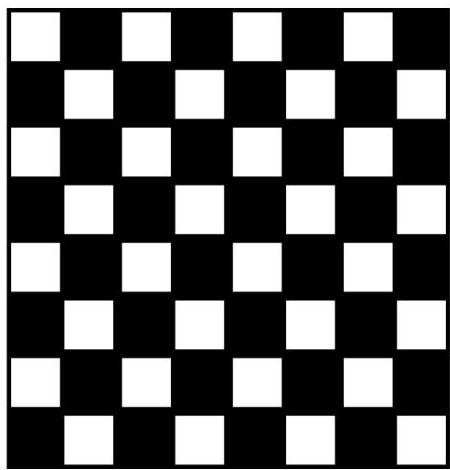
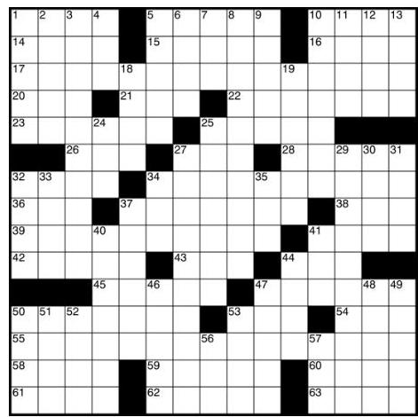
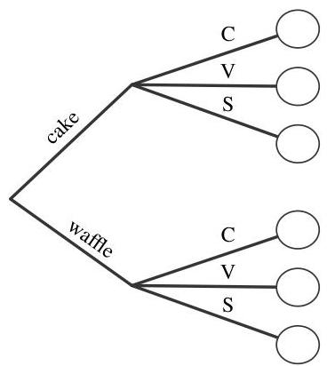
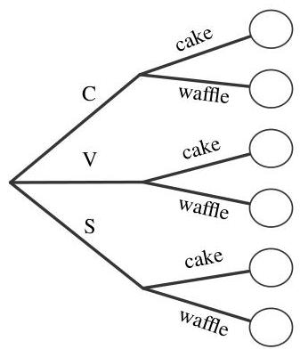

Introduction to Probability

FIGURE 1.3

An  $8 \times 8$  chessboard (left) and a crossword puzzle grid (right). The chessboard has  $8 \cdot 8 = 64$  squares, whereas counting the number of white squares in the crossword puzzle grid requires more work.

can also count the number of white squares using the multiplication rule: in each of the 8 rows there are 4 white squares, giving a total of  $8 \cdot 4 = 32$  white squares.

In contrast, it would require more effort to count the number of white squares in the crossword puzzle grid shown in Figure 1.3. The multiplication rule does not apply, since different rows sometimes have different numbers of white squares.  $\square$

Example 1.4.5 (Ice cream cones). Suppose you are buying an ice cream cone. You can choose whether to have a cake cone or a waffle cone, and whether to have chocolate, vanilla, or strawberry as your flavor. This decision process can be visualized with a tree diagram, as in Figure 1.4.

FIGURE 1.4

Tree diagram for choosing an ice cream cone. Regardless of whether the type of cone or the flavor is chosen first, there are  $2 \cdot 3 = 3 \cdot 2 = 6$  possibilities.