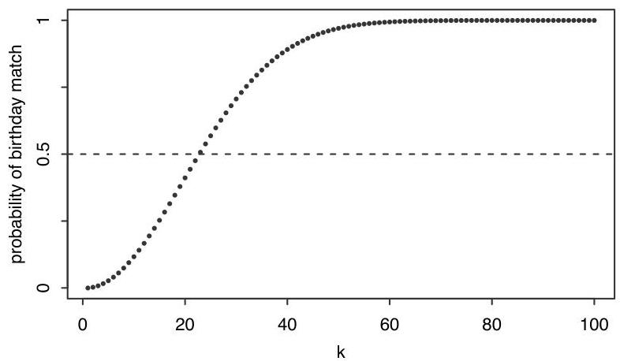

Probability and counting

But this counting problem is hard, since it could be Emma and Steve who share a birthday, or Steve and Naomi, or all three of them, or the three of them could share a birthday while two others in the group share a different birthday, or various other possibilities.

Instead, let's count the complement: the number of ways to assign birthdays to  $k$  people such that no two people share a birthday. This amounts to sampling the 365 days of the year without replacement, so the number of possibilities is  $365 \cdot 364 \cdot 363 \cdots (365 - k + 1)$  for  $k \leq 365$ . Therefore the probability of no birthday matches in a group of  $k$  people is

$$
P (\mathrm {n o b i r t h d a y m a t c h}) = \frac {3 6 5 \cdot 3 6 4 \cdots (3 6 5 - k + 1)}{3 6 5 ^ {k}},
$$

and the probability of at least one birthday match is

$$
P (\mathrm {a t l e a s t 1 b i r t h d a y m a t c h}) = 1 - \frac {3 6 5 \cdot 3 6 4 \cdots (3 6 5 - k + 1)}{3 6 5 ^ {k}}.
$$

Figure 1.5 plots the probability of at least one birthday match as a function of  $k$ . The first value of  $k$  for which the probability of a match exceeds 0.5 is  $k = 23$ . Thus, in a group of 23 people, there is a better than  $50\%$  chance that there is at least one birthday match. At  $k = 57$ , the probability of a match already exceeds  $99\%$ .

FIGURE 1.5

Probability that in a room of  $k$  people, at least two were born on the same day. This probability first exceeds 0.5 when  $k = 23$ .

Of course, for  $k = 366$  we are guaranteed to have a match, but it's surprising that even with a much smaller number of people it's overwhelmingly likely that there is a birthday match. For a quick intuition into why it should not be so surprising, note that with 23 people there are  $\binom{23}{2} = 253$  pairs of people, any of which could be a birthday match.