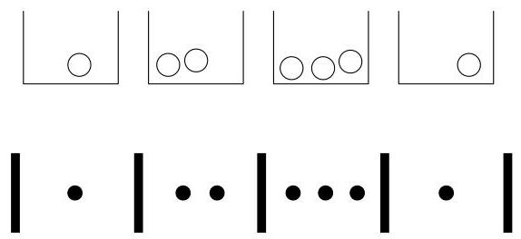

Probability and counting

possibility: all that matters are the counts for how many particles are in each box. This scenario is known as a Bose-Einstein problem, since the physicists Satyendra Nath Bose and Albert Einstein studied related problems about indistinguishable particles in the 1920s, using their ideas to successfully predict the existence of a strange state of matter known as a Bose-Einstein condensate.

Any configuration can be encoded as a sequence of  $|$ 's and  $\bullet$ 's in a natural way, as illustrated in Figure 1.6.

# FIGURE 1.6

Bose-Einstein encoding: putting  $k = 7$  indistinguishable particles into  $n = 4$  distinguishable boxes can be expressed as a sequence of  $|$ 's and  $\bullet$ 's, where  $|$  denotes a wall and  $\bullet$  denotes a particle.

To be valid, a sequence must start and end with a  $|$ , and have exactly  $n - 1$  's and exactly  $k$  's in between the starting and ending 's; conversely, any such sequence is a valid encoding for some configuration of particles in boxes. Imagine that we have written down the starting and ending 's, which represent the outer walls, and in between there are  $n + k - 1$  fill-in-the-blank slots in between the outer walls. We need only choose where to put the  $k$  's (since then where the  $n + k - 1$  interior 's go is completely determined). So the number of possibilities is  $\binom{n+k-1}{k}$ . This counting method is sometimes called the stars and bars argument, where here we have dots in place of stars.

To relate this result back to the original question, we can let each box correspond to one of the  $n$  objects and use the particles as "check marks" to tally how many times each object is selected. For example, if a certain box contains exactly 3 particles, that means the object corresponding to that box was chosen exactly 3 times. The particles being indistinguishable corresponds to the fact that we don't care about the order in which the objects are chosen. Thus, the answer to the original question is also  $\binom{n+k-1}{k}$ .

Another isomorphic problem is to count the number of solutions  $(x_{1},\ldots ,x_{n})$  to the equation  $x_{1} + x_{2} + \dots +x_{n} = k$ , where the  $x_{i}$  are nonnegative integers. This is equivalent since we can think of  $x_{i}$  as the number of particles in the  $i$ th box.

$\star 1.4.23$ . The Bose-Einstein result should not be used in the naive definition of probability except in very special circumstances. For example, consider a survey where a sample of size  $k$  is collected by choosing people from a population of size  $n$