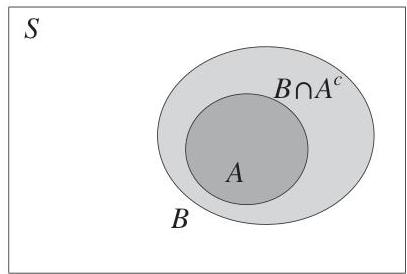
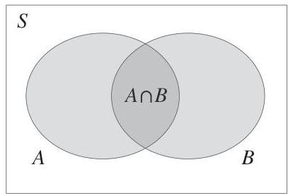

Probability and counting

The Bayesian and frequentist perspectives are complementary, and both will be helpful for developing intuition in later chapters. Regardless of how we choose to interpret probability, we can use the two axioms to derive other properties of probability, and these results will hold for any valid probability function.

Theorem 1.6.2 (Properties of probability). Probability has the following properties, for any events  $A$  and  $B$ .

1.  $P(A^c) = 1 - P(A)$ .
2. If  $A \subseteq B$ , then  $P(A) \leq P(B)$ .
3.  $P(A\cup B) = P(A) + P(B) - P(A\cap B)$

# Proof.

1. Since  $A$  and  $A^c$  are disjoint and their union is  $S$ , the second axiom gives

$$
P (S) = P (A \cup A ^ {c}) = P (A) + P (A ^ {c}),
$$

But  $P(S) = 1$  by the first axiom. So  $P(A) + P(A^c) = 1$ .

2. If  $A \subseteq B$ , then we can write  $B$  as the union of  $A$  and  $B \cap A^c$ , where  $B \cap A^c$  is the part of  $B$  not also in  $A$ . This is illustrated in the Venn diagram below.

Since  $A$  and  $B \cap A^c$  are disjoint, we can apply the second axiom:

$$
P (B) = P (A \cup (B \cap A ^ {c})) = P (A) + P (B \cap A ^ {c}).
$$

Probability is nonnegative, so  $P(B \cap A^c) \geq 0$ , proving that  $P(B) \geq P(A)$ .

3. The intuition for this result can be seen using a Venn diagram like the one below.

