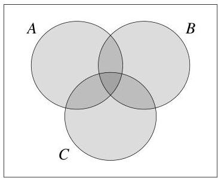

Introduction to Probability

The shaded region represents $A\cup B$, but the probability of this region is not the sum $P(A)+P(B)$, because that would count the football-shaped region $A\cap B$ twice. To correct for this, we subtract $P(A\cap B)$. This is a useful intuition, but not a proof.

For a proof using the axioms of probability, we can write $A\cup B$ as the union of the disjoint events $A$ and $B\cap A^{c}$. Then by the second axiom,

$P(A\cup B)=P(A\cup(B\cap A^{c}))=P(A)+P(B\cap A^{c}).$

So it suffices to show that $P(B\cap A^{c})=P(B)-P(A\cap B)$. Since $A\cap B$ and $B\cap A^{c}$ are disjoint and their union is $B$, another application of the second axiom gives us

$P(A\cap B)+P(B\cap A^{c})=P(B).$

So $P(B\cap A^{c})=P(B)-P(A\cap B)$, as desired.

The third property is a special case of inclusion-exclusion, a formula for finding the probability of a union of events when the events are not necessarily disjoint. We showed above that for two events $A$ and $B$,

$P(A\cup B)=P(A)+P(B)-P(A\cap B).$

For three events, inclusion-exclusion says

$P(A\cup B\cup C)$ $=P(A)+P(B)+P(C)$
$\quad-P(A\cap B)-P(A\cap C)-P(B\cap C)$
$\quad+P(A\cap B\cap C).$

For intuition, consider a triple Venn diagram like the one below.

To get the total area of the shaded region $A\cup B\cup C$, we start by adding the areas of the three circles, $P(A)+P(B)+P(C)$. The three football-shaped regions have each been counted twice, so we then subtract $P(A\cap B)+P(A\cap C)+P(B\cap C)$. Finally, the region in the center has been added three times and subtracted three times, so in order to count it exactly once, we must add it back again. This ensures that each region of the diagram has been counted once and exactly once.

Now we can write inclusion-exclusion for $n$ events.