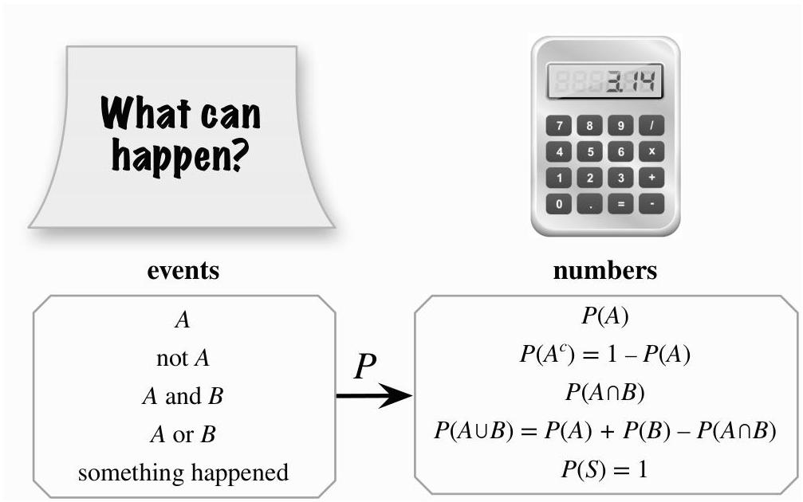

Introduction to Probability

FIGURE 1.7 It is important to distinguish between events and probabilities. The former are sets, while the latter are numbers. Before the experiment is done, we generally don't know whether or not a particular event will occur (happen). So we assign it a probability of happening, using a probability function  $P$ . We can use set operations to define new events in terms of old events, and the properties of probabilities to relate the probabilities of the new events to those of the old events.