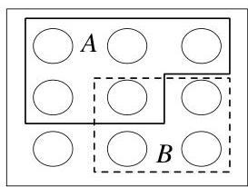
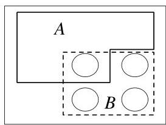
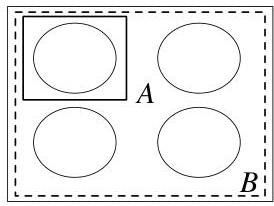

Introduction to Probability

Intuition 2.2.3 (Pebble World). Consider a finite sample space, with the outcomes visualized as pebbles with total mass 1. Since  $A$  is an event, it is a set of pebbles, and likewise for  $B$ . Figure 2.1(a) shows an example.

# FIGURE 2.1

Pebble World intuition for  $P(A|B)$ . From left to right: (a) Events  $A$  and  $B$  are subsets of the sample space. (b) Because we know  $B$  occurred, get rid of the outcomes in  $B^c$ . (c) In the restricted sample space, renormalize so the total mass is still 1.

Now suppose that we learn that  $B$  occurred. In Figure 2.1(b), upon obtaining this information, we get rid of all the pebbles in  $B^c$  because they are incompatible with the knowledge that  $B$  has occurred. Then  $P(A \cap B)$  is the total mass of the pebbles remaining in  $A$ . Finally, in Figure 2.1(c), we renormalize, that is, divide all the masses by a constant so that the new total mass of the remaining pebbles is 1. This is achieved by dividing by  $P(B)$ , the total mass of the pebbles in  $B$ . The updated mass of the outcomes corresponding to event  $A$  is the conditional probability  $P(A|B) = P(A \cap B) / P(B)$ .

In this way, our probabilities have been updated in accordance with the observed evidence. Outcomes that contradict the evidence are discarded, and their mass is redistributed among the remaining outcomes, preserving the relative masses of the remaining outcomes. For example, if pebble 2 weighs twice as much as pebble 1 initially, and both are contained in  $B$ , then after conditioning on  $B$  it is still true that pebble 2 weighs twice as much as pebble 1. But if pebble 2 is not contained in  $B$ , then after conditioning on  $B$  its mass is updated to 0.

Intuition 2.2.4 (Frequentist interpretation). Recall that the frequentist interpretation of probability is based on relative frequency over a large number of repeated trials. Imagine repeating our experiment many times, generating a long list of observed outcomes. The conditional probability of  $A$  given  $B$  can then be thought of in a natural way: it is the fraction of times that  $A$  occurs, restricting attention to the trials where  $B$  occurs.

In Figure 2.2, our experiment has outcomes which can be written as a string of 0's and 1's;  $B$  is the event that the first digit is 1 and  $A$  is the event that the second digit is 1. Conditioning on  $B$ , we circle all the repetitions where  $B$  occurred, and then we look at the fraction of circled repetitions in which event  $A$  also occurred.

In symbols, let  $n_A, n_B, n_{AB}$  be the number of occurrences of  $A, B, A \cap B$  respectively in a large number  $n$  of repetitions of the experiment. The frequentist interpretation