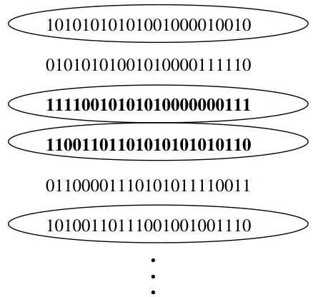

Conditional probability

is that

$P(A)\approx\frac{n_{A}}{n},\,P(B)\approx\frac{n_{B}}{n},\,P(A\cap B)\approx\frac{n_{AB}}{n}.$

Then $P(A|B)$ is interpreted as $n_{AB}/n_{B}$, which equals $(n_{AB}/n)/(n_{B}/n)$. This interpretation again translates to $P(A|B)=P(A\cap B)/P(B)$. ∎

FIGURE 2.2

Frequentist intuition for $P(A|B)$. The repetitions where $B$ occurred are circled; among these, the repetitions where $A$ occurred are highlighted in bold. $P(A|B)$ is the long-run relative frequency of the repetitions where $A$ occurs, within the subset of repetitions where $B$ occurs.

For practice with applying the definition of conditional probability, let’s do some more examples. The next three examples all start with the same basic scenario of a family with two children, but subtleties arise depending on the exact assumptions and the exact information we condition on.

###### Example 2.2.5 (Two children).

Martin Gardner posed the following puzzle in the 1950s, in his column in Scientific American.

- *Mr. Jones has two children. The older child is a girl. What is the probability that both children are girls?*
- *Mr. Smith has two children. At least one of them is a boy. What is the probability that both children are boys?*

At first glance this problem seems like it should be a simple application of conditional probability, but for decades there have been controversies about whether or why the two parts of the problem should have different answers, and the extent to which the problem is ambiguous. Gardner gave the answers $1/2$ and $1/3$ to the two parts, respectively, which may seem paradoxical: why should it matter whether we learn the older child’s gender, as opposed to just learning one child’s gender?

It is important to clarify the assumptions of the problem. Several implicit assumptions are being made to obtain the answers that Gardner gave.