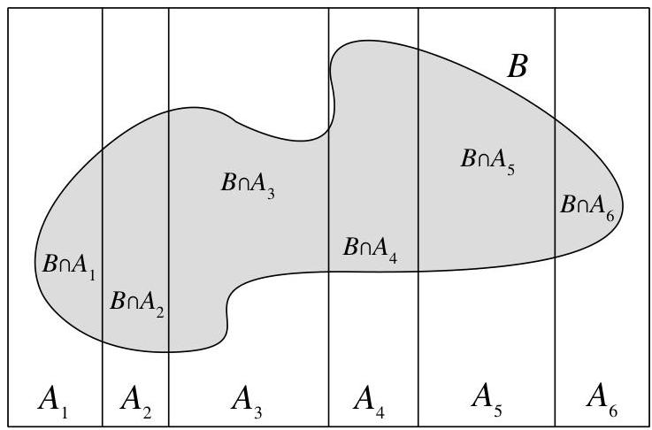

Conditional probability

FIGURE 2.3 The  $A_{i}$  partition the sample space;  $P(B)$  is equal to  $\sum_{i}P(B\cap A_{i})$

Example 2.3.7 (Random coin). You have one fair coin, and one biased coin which lands Heads with probability  $3/4$ . You pick one of the coins at random and flip it three times. It lands Heads all three times. Given this information, what is the probability that the coin you picked is the fair one?

# Solution:

Let  $A$  be the event that the chosen coin lands Heads three times and let  $F$  be the event that we picked the fair coin. We are interested in  $P(F|A)$ , but it is easier to find  $P(A|F)$  and  $P(A|F^c)$  since it helps to know which coin we have; this suggests using Bayes' rule and the law of total probability. Doing so, we have

$$
\begin{array}{l} P (F | A) = \frac {P (A | F) P (F)}{P (A)} \\ = \frac {P (A | F) P (F)}{P (A | F) P (F) + P (A | F ^ {c}) P (F ^ {c})} \\ = \frac {(1 / 2) ^ {3} \cdot 1 / 2}{(1 / 2) ^ {3} \cdot 1 / 2 + (3 / 4) ^ {3} \cdot 1 / 2} \\ \approx 0. 2 3. \\ \end{array}
$$

Before flipping the coin, we thought we were equally likely to have picked the fair coin as the biased coin:  $P(F) = P(F^c) = 1/2$ . Upon observing three Heads, however, it becomes more likely that we've chosen the biased coin than the fair coin, so  $P(F|A)$  is only about 0.23.

$\Leftrightarrow$  2.3.8 (Prior vs. posterior). It would not be correct in the calculation in the above example to say after the first step, “ $P(A) = 1$  because we know  $A$  happened.” It is true that  $P(A|A) = 1$ , but  $P(A)$  is the prior probability of  $A$  and  $P(F)$  is the prior probability of  $F$ —both are the probabilities before we observe any data in the