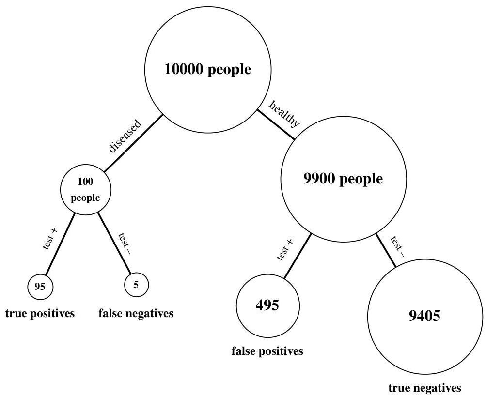

Conditional probability

FIGURE 2.4

Testing for a rare disease in a population of 10000 people, where the prevalence of the disease is  $1\%$  and the true positive and true negative rates are both equal to  $95\%$ . Bubbles are not to scale.