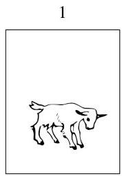
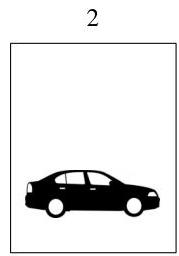
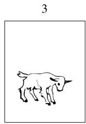

Conditional probability

# Solution:

Let's label the doors 1 through 3. Without loss of generality, we can assume the contestant picked door 1 (if she didn't pick door 1, we could simply relabel the doors, or rewrite this solution with the door numbers permuted). Monty opens a door, revealing a goat. As the contestant decides whether or not to switch to the remaining unopened door, what does she really wish she knew? Naturally, her decision would be a lot easier if she knew where the car was! This suggests that we should condition on the location of the car. Let  $C_i$  be the event that the car is behind door  $i$ , for  $i = 1,2,3$ . By the law of total probability,

$$
P (\mathrm {g e t c a r}) = P (\mathrm {g e t c a r} | C _ {1}) \cdot \frac {1}{3} + P (\mathrm {g e t c a r} | C _ {2}) \cdot \frac {1}{3} + P (\mathrm {g e t c a r} | C _ {3}) \cdot \frac {1}{3}.
$$

Suppose the contestant employs the switching strategy. If the car is behind door 1, then switching will fail, so  $P(\text{get car}|C_1) = 0$ . If the car is behind door 2 or 3, then because Monty always reveals a goat, the remaining unopened door must contain the car, so switching will succeed. Thus,

$$
P (\mathrm {g e t c a r}) = 0 \cdot \frac {1}{3} + 1 \cdot \frac {1}{3} + 1 \cdot \frac {1}{3} = \frac {2}{3},
$$

so the switching strategy succeeds  $2/3$  of the time. The contestant should switch to the other door.

Figure 2.5 is a tree diagram of the argument we have just outlined: using the switching strategy, the contestant will win as long as the car is behind doors 2 or 3, which has probability  $2/3$ . We can also give an intuitive frequentist argument in favor of switching. Imagine playing this game 1000 times. Typically, about 333 times your initial guess for the car's location will be correct, in which case switching will fail. The other 667 or so times, you will win by switching.

There's a subtlety though, which is that when the contestant chooses whether to switch, she also knows which door Monty opened. We showed that the unconditional probability of success is  $2/3$  (when following the switching strategy), but let's also show that the conditional probability of success for switching, given the information that Monty provides, is also  $2/3$ .

Let  $M_j$  be the event that Monty opens door  $j$ , for  $j = 2,3$ . Then

$$
P (\mathrm {g e t c a r}) = P (\mathrm {g e t c a r} | M _ {2}) P (M _ {2}) + P (\mathrm {g e t c a r} | M _ {3}) P (M _ {3}),
$$