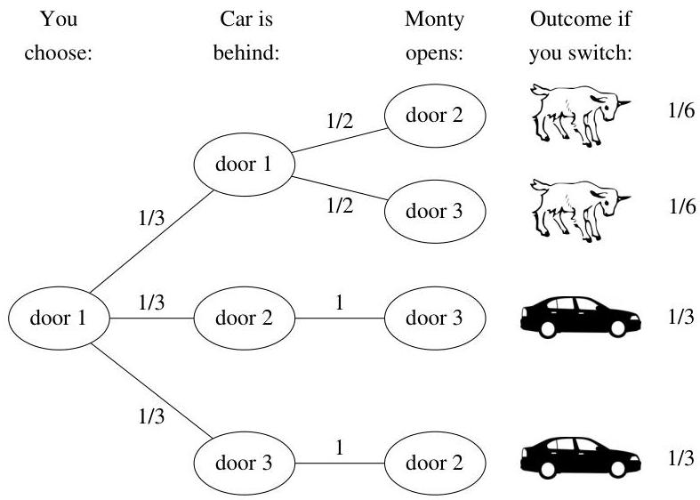

Introduction to Probability

FIGURE 2.5 Tree diagram of Monty Hall problem. Switching gets the car  $2 / 3$  of the time.

where by symmetry  $P(M_2) = P(M_3) = 1/2$  and  $P(\text{get car}|M_2) = P(\text{get car}|M_3)$ . The symmetry here is that there is nothing in the statement of the problem that distinguishes between door 2 and door 3; in contrast, Problem 40 considers a scenario where Monty enjoys opening door 2 more than he enjoys opening door 3.

Let  $x = P(\text{get car}|M_2) = P(\text{get car}|M_3)$ . Plugging in what we know,

$$
\frac {2}{3} = P (\mathrm {g e t c a r}) = \frac {x}{2} + \frac {x}{2} = x,
$$

as claimed.

Bayes' rule also works nicely for finding the conditional probability of success using the switching strategy, given the evidence. Suppose that Monty opens door 2. Using the notation and results above,

$$
P (C _ {1} | M _ {2}) = \frac {P (M _ {2} | C _ {1}) P (C _ {1})}{P (M _ {2})} = \frac {(1 / 2) (1 / 3)}{1 / 2} = \frac {1}{3}.
$$

So given that Monty opens door 2, there is a  $1/3$  chance that the contestant's original choice of door has the car, which means that there is a  $2/3$  chance that the switching strategy will succeed.

Many people, upon seeing this problem for the first time, argue that there is no advantage to switching: "There are two doors remaining, and one of them has the car, so the chances are 50-50." After the last chapter, we recognize that this argument misapplies the naive definition of probability. Yet the naive definition, even when inappropriate, has a powerful hold on people's intuitions. When Marilyn vos Savant presented a correct solution to the Monty Hall problem in her column