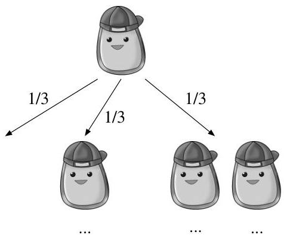

Conditional probability

for Parade magazine in 1990, she received thousands upon thousands of letters from readers (even mathematicians) insisting that she was wrong.

To build correct intuition, let's consider an extreme case. Suppose that there are a million doors, 999,999 of which contain goats and 1 of which has a car. After the contestant's initial pick, Monty opens 999,998 doors with goats behind them and offers the choice to switch. In this extreme case, it becomes clear that the probabilities are not 50-50 for the two unopened doors; very few people would stubbornly stick with their original choice. The same is true for the three-door case.

Just as we had to make assumptions about how we came across the random girl in Example 2.2.6, here the  $2/3$  success rate of the switching strategy depends on the assumptions we make about how Monty decides which door to open. In the exercises, we consider several variants and generalizations of the Monty Hall problem, some of which change the desirability of the switching strategy.  $\square$

# 2.7.2 Strategy: condition on the first step

In problems with a recursive structure, it can often be useful to condition on the first step of the experiment. The next two examples apply this strategy, which we call first-step analysis.

Example 2.7.2 (Branching process). A single amoeba, Bobo, lives in a pond. After one minute Bobo will either die, split into two amoebas, or stay the same, with equal probability, and in subsequent minutes all living amoebas will behave the same way, independently. What is the probability that the amoeba population will eventually die out?

# Solution:

Let  $D$  be the event that the population eventually dies out; we want to find  $P(D)$ . We proceed by conditioning on the outcome at the first step: let  $B_i$  be the event that Bobo turns into  $i$  amoebas after the first minute, for  $i = 0,1,2$ . We know  $P(D|B_0) = 1$  and  $P(D|B_1) = P(D)$  (if Bobo stays the same, we're back to where we started). If Bobo splits into two, then we just have two independent versions