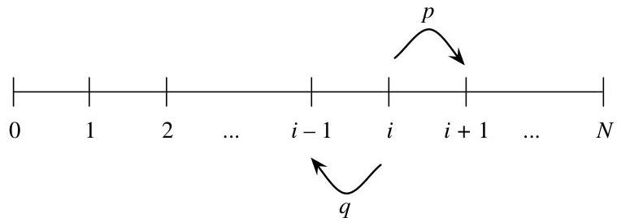

Introduction to Probability

of our original problem! We need both of the offspring to eventually die out, so  $P(D|B_2) = P(D)^2$ . Now we have exhausted all the possible cases and can combine them with the law of total probability:

$$
\begin{array}{l} P (D) = P (D | B _ {0}) \cdot \frac {1}{3} + P (D | B _ {1}) \cdot \frac {1}{3} + P (D | B _ {2}) \cdot \frac {1}{3} \\ = 1 \cdot \frac {1}{3} + P (D) \cdot \frac {1}{3} + P (D) ^ {2} \cdot \frac {1}{3}. \\ \end{array}
$$

Solving for  $P(D)$  gives  $P(D) = 1$ : the amoeba population will die out with probability 1.

The strategy of first-step analysis works here because the problem is self-similar in nature: when Bobo continues as a single amoeba or splits into two, we end up with another version or another two versions of our original problem. Conditioning on the first step allows us to express  $P(D)$  in terms of itself.

Example 2.7.3 (Gambler's ruin). Two gamblers, A and B, make a sequence of $1 bets. In each bet, gambler A has probability  $p$  of winning, and gambler B has probability  $q = 1 - p$  of winning. Gambler A starts with  $i$  dollars and gambler B starts with  $N - i$  dollars; the total wealth between the two remains constant since every time A loses a dollar, the dollar goes to B, and vice versa.

We can visualize this game as a random walk on the integers between 0 and  $N$ , where  $p$  is the probability of going to the right in a given step: imagine a person who starts at position  $i$  and, at each time step, moves one step to the right with probability  $p$  and one step to the left with probability  $q = 1 - p$ . The game ends when either A or B is ruined, i.e., when the random walk reaches 0 or  $N$ . What is the probability that A wins the game (walking away with all the money)?

# Solution:

We recognize that this game, like Bobo's reproductive process, has a recursive structure: after the first step, it's exactly the same game, except that A's wealth is now either  $i + 1$  or  $i - 1$ . Let  $p_i$  be the probability that A wins the game, given that A starts with  $i$  dollars. We will use first-step analysis to solve for the  $p_i$ . Let  $W$  be the event that A wins the game. By LOTP, conditioning on the outcome of the first