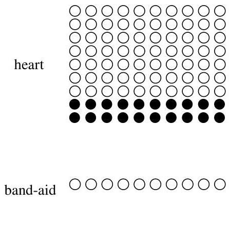
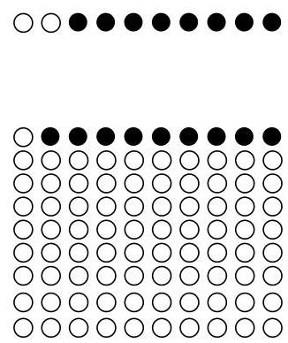

Conditional probability

Dr. Hibbert

Dr. Nick

# FIGURE 2.6

An example of Simpson's paradox. White dots represent successful surgeries and black dots represent failed surgeries. Dr. Hibbert is better in both types of surgery but has a lower overall success rate, because he is performing the harder type of surgery much more often than Dr. Nick is.

What's happening is that Dr. Hibbert, presumably due to his reputation as the superior doctor, is performing a greater number of heart surgeries, which are inherently riskier than Band-Aid removals. His overall success rate is lower not because of lesser skill on any particular type of surgery, but because a larger fraction of his surgeries are risky.

Let's use event notation to make this precise. For events  $A$ ,  $B$ , and  $C$ , we say that we have a Simpson's paradox if

$$
P (A | B, C) &lt;   P (A | B ^ {c}, C)
$$

$$
P (A | B, C ^ {c}) &lt;   P (A | B ^ {c}, C ^ {c}),
$$

but

$$
P (A | B) &gt; P (A | B ^ {c}).
$$

In this case, let  $A$  be the event of a successful surgery,  $B$  be the event that Dr. Nick is the surgeon, and  $C$  be the event that the surgery is a heart surgery. The conditions for Simpson's paradox are fulfilled because the probability of a successful surgery is lower under Dr. Nick than under Dr. Hibbert whether we condition on heart surgery or on Band-Aid removal, but the overall probability of success is higher for Dr. Nick.

The law of total probability tells us mathematically why this can happen:

$$
P (A | B) = P (A | C, B) P (C | B) + P (A | C ^ {c}, B) P (C ^ {c} | B)
$$

$$
P (A | B ^ {c}) = P (A | C, B ^ {c}) P (C | B ^ {c}) + P (A | C ^ {c}, B ^ {c}) P (C ^ {c} | B ^ {c}).
$$