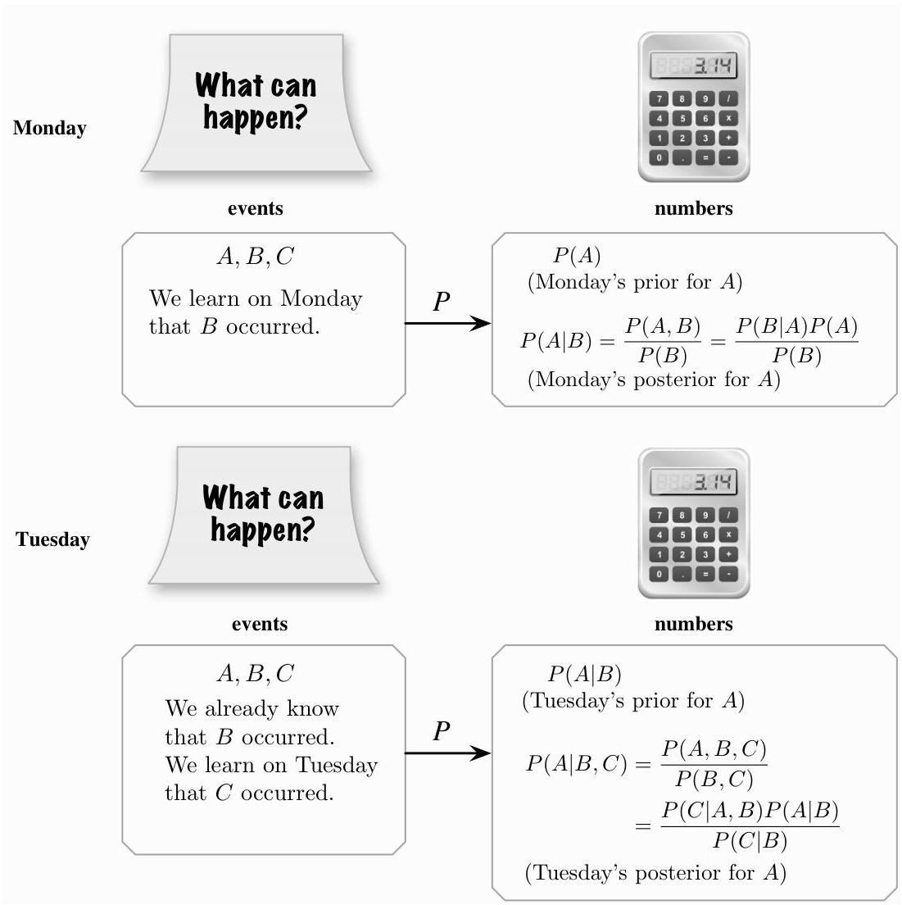

Conditional probability

FIGURE 2.7 Conditional probability tells us how to update probabilities as new evidence comes in. Shown are the probabilities for an event  $A$  initially, after obtaining one piece of evidence  $B$ , and after obtaining a second piece of evidence  $C$ . The posterior for  $A$  after observing the first piece of evidence becomes the new prior before observing the second piece of evidence. After both  $B$  and  $C$  are observed, a new posterior for  $A$  can be found in various ways. This then becomes the new prior if more evidence will be collected.