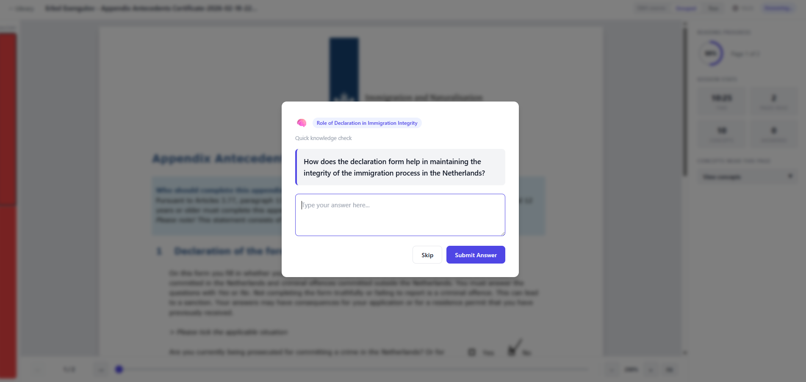
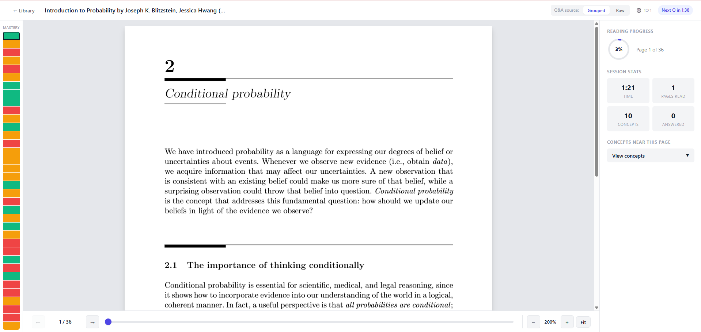
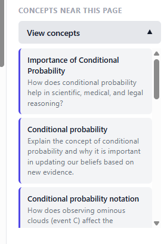
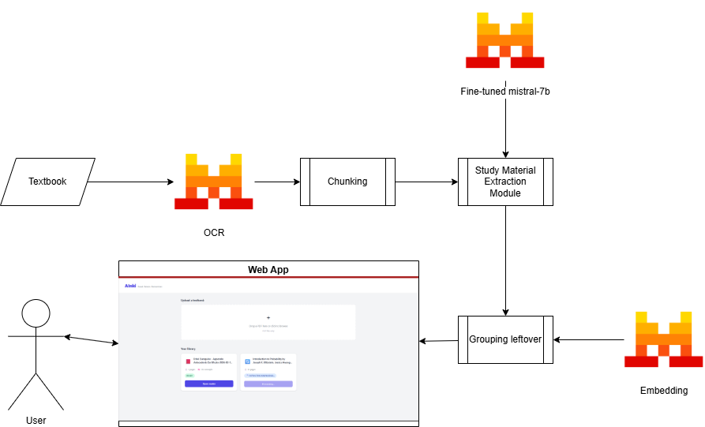

# AInki

**Read. Retain. Remember.**

> **WIP** — Concept / prototype. Not a full-fledged feature yet.

AInki is a web application that helps users absorb knowledge efficiently using a **spaced-repetition** approach inspired by [Anki](https://apps.ankiweb.net/). Upload a textbook PDF, and AInki turns it into study material with timed popups, mastery tracking, and a topic list.

## Features

1. **Timed popups** — Check your understanding of past topics at intervals.
2. **Mastery bar** — See how well you know each section of the book.
3. **Topic list** — Browse all extracted knowledge and track progress.

  
  


## Pipeline

High-level flow:

1. **Textbook (PDF)** → **Mistral OCR** → text + structure
2. **Chunking** → split text into overlapping chunks
3. **Study material extraction** → Mistral (optionally fine-tuned) extracts Q&A-style knowledge objects
4. **Embedding** → Mistral Embed for semantic search
5. **Grouping** → cluster similar knowledge for the UI
6. **Web app** → library, reader, popups, mastery



## Requirements

- **Python 3.13+**
- **Mistral API key** (for OCR, chat, embeddings)
- Optional: Langfuse, W&B, Hugging Face (for fine-tuning and observability)

## Setup (local)

### 1. Clone and install

```bash
git clone <repo-url>
cd mistral-hackathon
uv sync
```

### 2. Environment

Copy `.env.example` to `.env` and set at least:

- `MISTRAL_API_KEY` — required for OCR, knowledge extraction, embeddings
- `LLM_PROVIDER=mistral`

Optional: `LANGFUSE_*`, `WANDB_API_KEY`, `CHUNK_SIZE`, `STRIDE`, `SIMILARITY_THRESHOLD`.

### 3. Run the app

```bash
uv run uvicorn app:app --host 0.0.0.0 --port 8000 --reload
```

Open **http://localhost:8000** — upload a PDF and wait for the pipeline to finish.

## Docker

Build and run with Docker Compose. **Data is stored in a local volume** so books and processing outputs persist between runs.

### Build and run

```bash
docker compose up -d --build
```

- App: **http://localhost:8000**
- Data directory on the host: `./data` (created automatically and mounted into the container).

### Compose layout

- **Service**: `app` — runs `uvicorn app:app --host 0.0.0.0 --port 8000`.
- **Volume**: `./data` → `/app/data` (PDFs, OCR output, chunks, knowledge objects, embeddings).
- **Env**: `.env` is loaded by the app; set `MISTRAL_API_KEY` (and any other keys) in `.env` before `docker compose up`.

### Commands

```bash
# Run in background
docker compose up -d --build

# View logs
docker compose logs -f app

# Stop
docker compose down
```

Data in `./data` is kept when you stop or remove the container.

## Project layout

| Path | Purpose |
|------|--------|
| `app.py` | FastAPI app, routes, static serving |
| `api/` | Library and reader API routes |
| `services/` | Pipeline orchestration (OCR → chunk → analyze → embed → merge) |
| `paths.py` | Data paths (`data/`, `data/pdfs/`, `data/ocr/`, etc.) |
| `config.py` | Settings (Mistral, Langfuse, chunk size, etc.) |
| `ocr_service.py` | Mistral OCR (PDF → JSON + markdown) |
| `chunks_service.py` | Text chunking |
| `knowledge_service.py` | Knowledge extraction (Mistral) |
| `embed_service.py` | Embeddings and grouping |
| `generate_data_service.py` | Build training data (golden outputs) and filter by relevance |
| `fine-tuning/` | Fine-tune Mistral (HuggingFace or Mistral API) |
| `data/` | **Persistent** — PDFs, OCR, chunks, knowledge objects, embeddings (mount in Docker) |
| `static/` | Frontend (library + reader HTML/JS/CSS) |
| `misc/` | Screenshots, pipeline diagram |

## Scripts (optional)

- **Generate training data**: `uv run generate_data_service.py --mode generate`
- **Filter training data by relevance**: `uv run generate_data_service.py --mode filter`
- **Fine-tune (Mistral API)**: `uv run fine-tuning/finetune_api.py`
- **Fine-tune (HuggingFace/QLoRA)**: `uv run fine-tuning/finetune.py`

## License

See repository license file.
